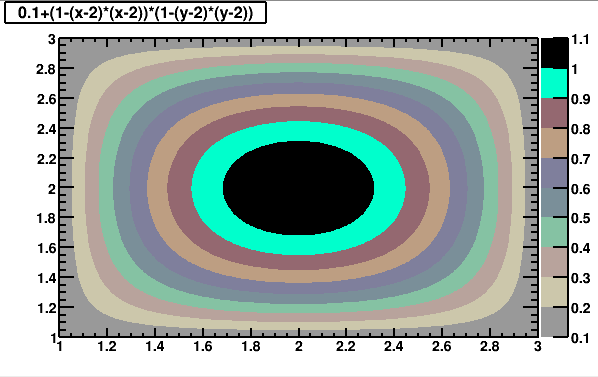
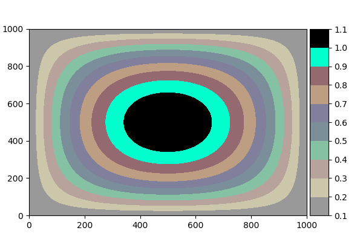

# Throwback
Old color maps that will really take you back...


## Examples

Do you ever feel nostalgic for that old default colormap from `ROOT` c.2007?
```
TCanvas *c1  = new TCanvas("c1","c1",0,0,600,400);
TF2 *f1 = new TF2("f1","0.1+(1-(x-2)*(x-2))*(1-(y-2)*(y-2))",1,3,1,3);
f1->SetNpx(1000);
f1->SetNpy(1000);
Double_t levels[] = {0.1,0.2,0.3,0.4,0.5,0.6,0.7,0.8,0.9,1.0,1.1};
f1->SetContour(20, levels);
gStyle->SetPalette(-1);
f1->Draw("colz") 
```



What a beautiful plot! How can I ever get something so attractive with `matplotlib`?

```
import throwback.cm 

def fn(x,y):
    return 0.1+(1-(x-2)*(x-2))*(1-(y-2)*(y-2))
xx,yy = np.meshgrid(np.linspace(1,3,1000),np.linspace(1,3,1000))

plt.figure(figsize=(6,4))
levels = np.arange(0.1,1.2,0.1)
plt.contourf(xx,yy,fn(xx,yy),levels,vmin=0.07,vmax=1.05,cmap='root')
plt.colorbar(ticks=levels,pad=0.01,aspect=10)
plt.subplots_adjust(left=0.08,right=0.99)
```

